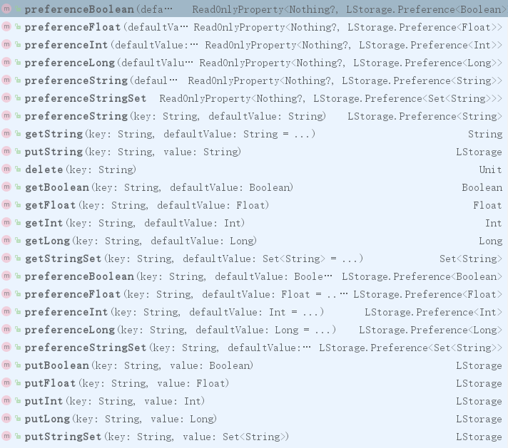

## 一个使用kotlin编写的Android数据缓存库(包含数据变动监听)

### 特性
1. 如果内存中已经存在该数据，在无需去文件中读取，加快读取速度
2. 缓存数据可以删除
3. 基于kotlin委托，写法简单，无需增加其他额外命名，可以设置默认值
4. 支持一下数据形式:Int, Long, Float, String, Boolean, StringSet
5. 可以监听数据变化，并回调监听动作
    > 监听可以移除；另外如果设置新的监听会替换掉前一个监听     
------
### 原理
* 基于LruCache进行内存缓存
* 基于SharedPreferences进行文件缓存
* 基于kotlin 委托进行数据变动监听
------
### 引入架包

In your root path  `build.gradle`:

```groovy
allprojects {
        repositories {
            maven { url "https://jitpack.io" }
        }
    }
```
In your Application Dir `build.gradle`:
```groovy
dependencies {
    implementation 'com.github.cat-x:LStorage:0.1'
}
```
------
### 使用方法
1. 在使用前你应该进行初始化
> 你可以在Application 或者 Activity等具有Context的组件中初始化，只需要调用1次即可
~~~kotlin
 override fun onCreate() {
        super.onCreate()
        LStorage.init(this)
    }
~~~
2. 函数调用
* 包含监听
~~~
val tappingEnabled by LStorage.SP.preferenceBoolean(true)
val content by LStorage.SP.preferenceString(初始数据")
//你也可以缓存及其监听Int, Long, Float, String, Boolean, StringSet这些类型

 //初始化数据同时开始监听
 content.observeAndInit {
    contentListenEditText.setText(it)
 }
 
 //设置监听
 content.observe {/**处理变化*/  }
    
 //设置数据
 content.set("hello")
 
 //获取数据
 tappingEnabled.get()
 
 //删除缓存
 content.delete()
~~~
* 不包含监听
~~~kotlin
 //设置数据
LStorage.SP.putString("contentCache", contentCacheEditText2.text.toString())
 //获取数据
LStorage.SP.getBoolean("contentCacheBoo", false)
 //删除缓存
LStorage.SP.delete()
~~~


>如果你想自己定义一个命名的配置文件可以可以的
~~~kotlin
val data = LStorage("myLStorage")
data.putString("contentCache", contentCacheEditText2.text.toString())
~~~

------
#### 函数列表截图

